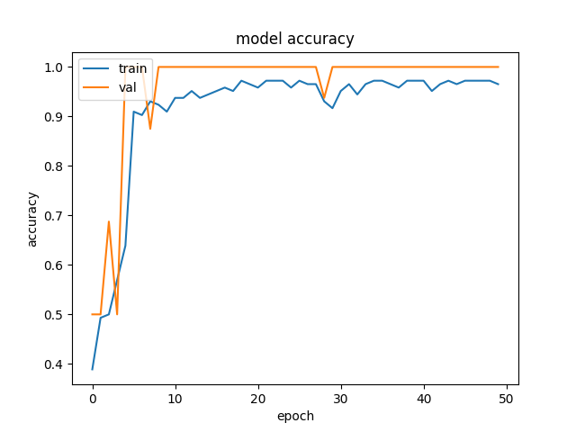
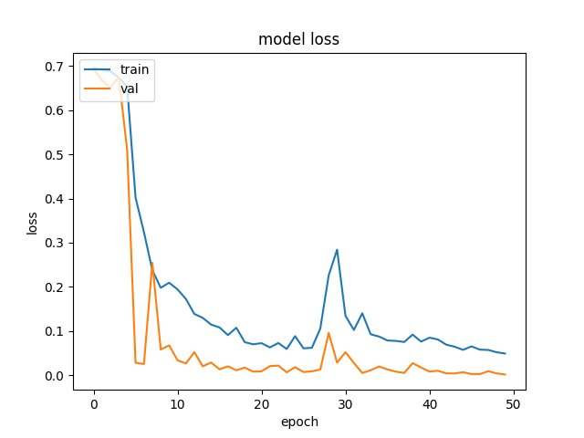
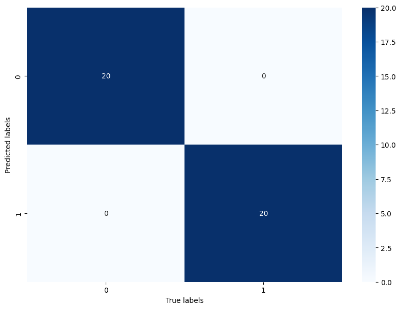

# Music features

## TC3002B

**José Ángel Rico Mendieta - A01707404**


Un género musical es una categoría convencional que identifica piezas musicales como pertenecientes a una tradición compartida o un conjunto de convenciones. Debe distinguirse de la forma musical y del estilo musical. Las características extraídas de estas ondas pueden ayudar a la máquina a distinguirlas.


## Instrucciones para correr el script
En la carpeta de [music](music), se debe poner las canciones a analizar, con las siguientes restricciones:
- Mínimo 30 segundo de la canción
- La extensión debe ser .wav
- El nombre de la canción no debe tener espacios


Después se puede correr el Script con el siguiente código:

```
py main.py
```

## Documentación del Dataset
Las características de este conjunto de datos se extraen del conjunto de datos proporcionado, [link del dataset](https://www.kaggle.com/datasets/insiyeah/musicfeatures?select=data_2genre.csv), que consta de 1000 pistas de audio cada una de 30 segundos de duración. Contiene 10 géneros, cada uno representado por 100 pistas. Todas las pistas son archivos de audio mono de 16 bits a 22050 Hz en formato .wav. El código utilizado para extraer funciones se encuentra en este repositorio de GitHub, [link del repositorio](https://github.com/Insiyaa/Music-Tagging). Las características se extraen utilizando la biblioteca libROSA, [ir a la biblioteca](https://librosa.github.io/librosa/).

### Información del dataset

El dataset es conformado por:

|  | **Tamaño** | 
| -------- | -------- | 
| Pop  |  100   | 
| Classical   | 100   | 
| **Total**   | **200**   | 

Se realizó un split de la información para realizar el entramiento, pruebas y validación:

|  | **Train** | **Test** | **Val** |
| -------- | -------- | -------- | -------- | 
| X  |  144 x 28   |  40 x 28   |   16 x 28   |
| Y   | 144 x 1   |   40 x 1   |  16 x 1   |


## Preprocesamiento de los datos

Se realizo un procesamiento en el manejo de las clases del dataset, asi como el debido escalamiento para el entrenamiento del modelo.
 - Pop = 0
 - Classical = 1

## Validación de los datos

En el split del dataset, se reservo el ocho porciento para la validación del modelo


## Implementación del modelo

Para la implementación del modelo,  revise los siguientes papers:
- [Music Recommender System Based on Genre using Convolutional Recurrent Neural Networks](https://0-www-sciencedirect-com.biblioteca-ils.tec.mx/science/article/pii/S1877050919310646)

- [Music Artist Classification with Convolutional
Recurrent Neural Networks](https://arxiv.org/pdf/1901.04555.pdf)

- [A public data-set for synchronous motor electrical faults diagnosis with CNN and LSTM reference classifiers](https://0-www-sciencedirect-com.biblioteca-ils.tec.mx/science/article/pii/S2666546823000460)

Con lo revisado se opto por cambiar a la siguiente estructura:

|**Layer**|**Size**|
|-|-|
| lstm | (None, 28, 52)|
| lstm | (None, 28, 52)|
| lstm | (None, 52)|
| Dense | (None, 134) |
| Dense | (None, 134) |
| Dense | (None, 2) |


Modelo previo:
|**Layer**|**Size**|
|-|-|
| SimpleRNN | (None, 20)|
| Dense | (None, 64) |
| Dense | (None, 32) |
| Dense | (None, 16) |
| Dense | (None, 2) |


Obteniendo las siguientes metricas:
- accuracy : 0.9652777910232544
- loss : 0.04887213185429573
- val_accuracy : 1.0
- val_loss : 0.0013587824068963528

  
## Prueba de modelo

En esta parte, usando el dataset de test, se evalúo el modelo con 40 casos y se obtuvo el siguiente resultado:

    accuracy:  1


Anterior modelo:

    accuracy:  0.9292


## Evaluación del modelo

Para evaluar el modelo, se obtuvieron las siguientes métricas:

|Metrica|Modelo 1|Modelo 2|
|-|-|-|
|Accuracy|0.9292|1|
|Loss|0.1250|0|

Tambien se obtuvo la matriz de confusión:


Anterior Modelo:


Obteniendo el tambien las tasas de verdaderos positivos y de falsos:

| Genre | Tasa de verdaderos positivos/Modelo1 | Tasa de falsos positivos/Modelo1 |Tasa de verdaderos positivos/Modelo2 | Tasa de falsos positivos/Modelo2|
|-|-|-|-|-|
|Pop|0.9411|0.0869|1|0|
|Classical|0.9130|0.0588|1|0|

## Refinamiento del modelo
Para mejorar los resultados, se opto por realizar una optimización de hiperparametros, con ayuda de la libreria optuna, obteniendo, los siguientes valores para los mismos:

|Variable|Valor|Descripción|
|-|-|-|
|units_lstm| 52| Unidades ocultas de las capaz lstm|
|learning_rate| 0.0023916625587450248 | Valor de cambio de aprendizaje|
|layers_number_lstm| 1| Cantidad de capaz lstm|
|layers_number_dense| 1|Cantidad de capaz densas|
|units|  134| Unidades ocultas de las capaz densas|

# Conclusiones
Con los resultados obtenidos, pudimos probar dos estructuras para el modelo, lo que resulto con dos altos resultados favorables, pero mejorando a pesar de que el primer modelo ya estaba relativamente aproximado, sin embargo, se pudo ver se puede identificar que no se necesitaban tantos epochs para obtener un resultado optimo, lo que podría llevarse también a la optimización de hiperparametros.

## Referencias
- Adiyansjah, Alexander A S Gunawan, Derwin Suhartono,
Music Recommender System Based on Genre using Convolutional Recurrent Neural Networks,
Procedia Computer Science,
Volume 157,
2019,
Pages 99-109,
ISSN 1877-0509,
https://0-www-sciencedirect-com.biblioteca-ils.tec.mx/science/article/pii/S1877050919310646

- Zain Nasrullah, Yue Zhao, Music Artist Classification with Convolutional
Recurrent Neural Networks,
https://arxiv.org/pdf/1901.04555.pdf

- Zhenglong Sun, Ram Machlev, Qianchao Wang, Juri Belikov, Yoash Levron, Dmitry Baimel,
A public data-set for synchronous motor electrical faults diagnosis with CNN and LSTM reference classifiers,
Energy and AI,
Volume 14,
2023,
100274,
ISSN 2666-5468, https://0-www-sciencedirect-com.biblioteca-ils.tec.mx/science/article/pii/S2666546823000460

