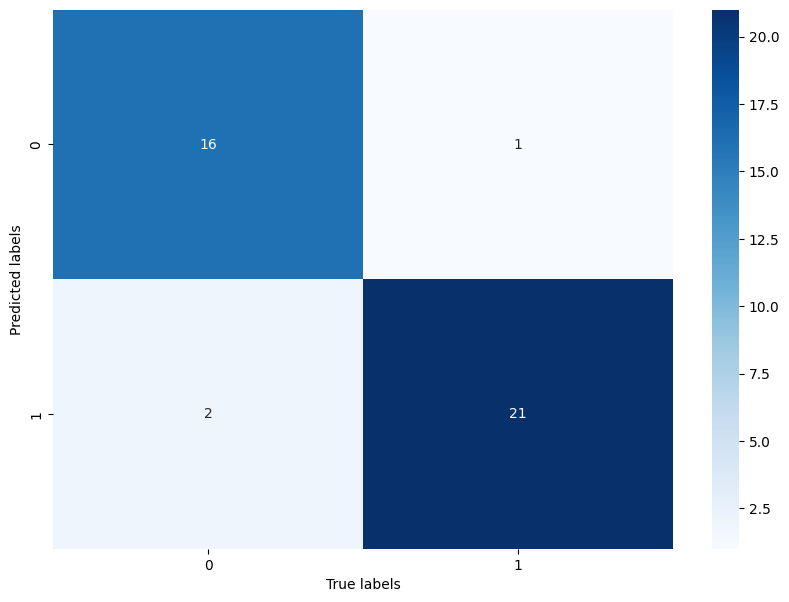

# Music features

## TC3002B

**José Ángel Rico Mendieta - A01707404**

Un género musical es una categoría convencional que identifica piezas musicales como pertenecientes a una tradición compartida o un conjunto de convenciones. Debe distinguirse de la forma musical y del estilo musical. Las características extraídas de estas ondas pueden ayudar a la máquina a distinguirlas.

## Documentación del Dataset
Las características de este conjunto de datos se extraen del conjunto de datos proporcionado, [link del dataset](https://www.kaggle.com/datasets/insiyeah/musicfeatures?select=data_2genre.csv), que consta de 1000 pistas de audio cada una de 30 segundos de duración. Contiene 10 géneros, cada uno representado por 100 pistas. Todas las pistas son archivos de audio mono de 16 bits a 22050 Hz en formato .wav. El código utilizado para extraer funciones se encuentra en este repositorio de GitHub, [link del repositorio](https://github.com/Insiyaa/Music-Tagging). Las características se extraen utilizando la biblioteca libROSA, [ir a la biblioteca](https://librosa.github.io/librosa/).

### Información del dataset

El dataset es conformado por:

|  | **Tamaño** | 
| -------- | -------- | 
| Pop  |  100   | 
| Classical   | 100   | 
| **Total**   | **200**   | 

Se realizó un split de la información para realizar el entramiento, pruebas y validación:

|  | **Train** | **Test** | **Val** |
| -------- | -------- | -------- | -------- | 
| X  |  144 x 28   |  40 x 28   |   16 x 28   |
| Y   | 144 x 1   |   40 x 1   |  16 x 1   |

## Preprocesamiento de los datos

Se realizo un procesamiento en el manejo de las clases del dataset, asi como el debido escalamiento para el entrenamiento del modelo.
 - Pop = 0
 - Classical = 1

## Validación de los datos

En el split del dataset, se reservo el ocho porciento para la validación del modelo

## Implementación del modelo

Para la implementación del modelo,  revise los siguientes papers:
 - [Music Recommender System Based on Genre using Convolutional Recurrent Neural Networks](https://0-www-sciencedirect-com.biblioteca-ils.tec.mx/science/article/pii/S1877050919310646)

 - [Music Artist Classification with Convolutional
Recurrent Neural Networks](https://arxiv.org/pdf/1901.04555.pdf)

Con lo revisado se opto pot la siguiente estructura:

|**Layer**|**Size**|
|-|-|
| SimpleRNN | (None, 20)|
| Dense | (None, 64) |
| Dense | (None, 32) |
| Dense | (None, 16) |
| Dense | (None, 2) |

## Prueba de modelo

En esta parte, usando el dataset de test, se evalúo el modelo con 40 casos y se obtuvo el siguiente resultado:

accuracy:  0.9292

## Evaluación del modelo

Para evaluar el modelo, se obtuvieron las siguientes métricas:

- Accuracy: 0.9292 
- Loss: 0.1250 
- Precision: 0.9545

Tambien se obtuvo la matriz de confusión:

Obteniendo el tambien las tasas de verdaderos positivos y de falsos:

| Genre | Tasa de verdaderos positivos | Tasa de falsos positivos |
|-|-|-|
|Pop|0.9411|0.0869|
|Classical|0.9130|0.0588|

